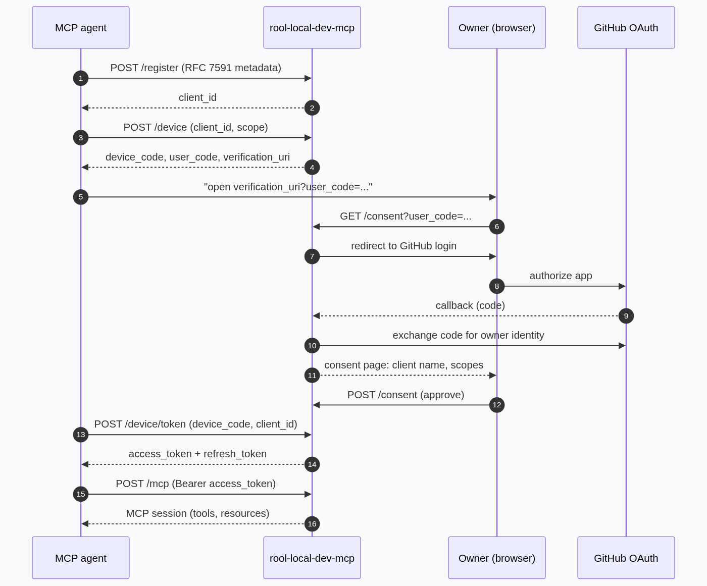

# rool-local-dev-mcp

A local-dev MCP server exposing sandboxed filesystem tools over HTTP, with
OAuth 2.1 delegated authorization. All file access is gated by a configured
deny-list.

## What it is

- Sandboxed filesystem tools (`list_dir`, `read_file`, `write_file`,
  `search_dir`) scoped to `SANDBOX_ROOT`, resolved at request time.
- OAuth 2.1 authorization server + MCP resource server composed in one ASGI
  app. Owners authenticate with GitHub; MCP clients get their own tokens.
- A two-tier deny-list (see below) enforced at a single choke point so
  every tool call — read, write, list, or search — respects it.

## Quick start

```bash
pip install -r requirements.txt
cp .env.example .env   # then fill in the values
python ./launcher.py   # or ./start.sh
```

Expose it publicly with `ngrok http 8000` (or your own tunnel) and set
`BASE_URL` to the public URL.

## Configuration

All configuration lives in `.env` (see `.env.example`). The deny-list
variables are comma-separated glob lists, parsed as CSV (quote entries
containing commas):

| Variable | Tier | Behavior |
| --- | --- | --- |
| `SENSITIVE_FILES` | `DENY_ALL` | Never readable or writable, anywhere |
| `DENIED_FOLDERS` | `DENY_ALL` | The folder and everything beneath it |
| `READ_ONLY_FOLDERS` | `DENY_WRITE` | Readable; writes always denied |

Env entries extend (not replace) the built-in defaults. Built-in defaults
cover credential stores (`.ssh/`, `.aws/`, `.kube/`, `.gnupg/`, `.docker/`),
key material (`*.pem`, `*.key`, `id_rsa*`, …), VCS internals (`.git/`,
`.hg/`, `.svn/`), other package managers (`node_modules/`, `.pypirc`,
`.npmrc`, …), and infrastructure state (`terraform.tfstate*`, `*.tfvars`).

Deny-list semantics:

- Matching runs on the **resolved** path (symlinks resolved,
  `..` segments normalized), so indirection cannot reach a denied file.
- A pattern with no glob metacharacters is treated as a **folder** and
  denied along with everything beneath it; glob patterns match by name.
- **Deny always wins.** The deny-list is checked after path-grant
  resolution, so even a granted folder cannot expose a denied file.
- Writes also check **ancestor directories**, so a denied folder cannot be
  created into via `write_file` with a nested path.

## Auth flow

The server composes an OAuth 2.1 authorization server with the MCP
resource server. Owners authenticate with GitHub (a GitHub OAuth app is
the upstream identity provider); MCP clients authenticate with the server
itself via dynamic client registration and the OAuth device grant.

### Endpoints

| Path | Purpose |
| --- | --- |
| `/health` | Liveness probe |
| `/register` | Dynamic client registration (RFC 7591) |
| `/authorize` | OAuth authorization endpoint (consent-gated) |
| `/consent` | Owner consent page (GitHub-authenticated session) |
| `/device` | Device grant start (RFC 8628) |
| `/device/token` | Device token polling |
| `/token` | Authorization-code / refresh-token exchange |
| `/mcp` | MCP streamable-HTTP transport (Bearer-protected) |

### Sequence

The flow below is the delegated-authorization path an MCP agent takes.
Steps 1-2 are done once per client; steps 3-9 repeat per session.




(The diagram source lives at [`docs/auth-flow.mmd`](docs/auth-flow.mmd); regenerate the
image with [mermaid.ink](https://mermaid.ink) or any mermaid renderer.)

### Notes

- **Registration requires `authorization_code` and `response_types:
  ["code"]`** even for device-only clients, because RFC 7591 metadata
  validation expects them. Headless clients should include both plus the
  device grant type.
- The device poll lives at `/device/token`, not `/token`.
- Access tokens are bearer tokens, stored hashed; refresh tokens rotate on
  use and can be revoked.
- The consent gate requires an owner session: only the GitHub account in
  `OWNER_GITHUB` can approve a client's device grant.
- The server enforces DNS-rebinding protection on the MCP transport
  (`allowed_hosts` / `allowed_origins` from `BASE_URL`).

## Deny-list rationale

The server runs a local filesystem bridge for an automated agent. The
deny-list exists because an agent may be prompted (or hijacked) into
touching files it should never read or write: environment files with live
secrets, SSH keys, cloud credentials, VCS internals, build caches. The
defaults are conservative and extensible via `.env`; the single
`_is_safe` choke point in `mcp_fs_server.py` is the place all tool calls
are gated.

## Development

```bash
python -m venv .venv
source .venv/bin/activate
pip install -r requirements.txt
python ./launcher.py
```

`deny_list.py` holds the defaults and the tier model;
`mcp_fs_server.py` implements the MCP tools and the `_is_safe` gate;
`auth.py` composes the OAuth AS + consent flow; `db.py` is the token and
client store (SQLite).
